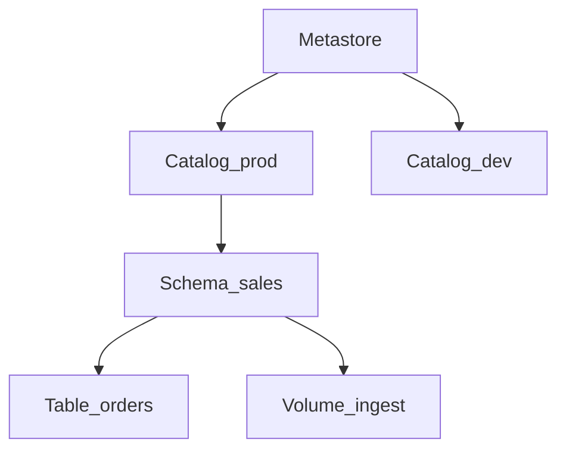

# Unity Catalog cookbook

Loaded from `SKILL.md` when the task touches governance: grants, managed vs external tables, storage credentials, external locations, lineage, federation, Delta Sharing, audit, masking.

Unity Catalog (UC) is the **governance plane**: one metastore (per region / deployment pattern) exposes **three-level names** `catalog.schema.securable` (tables, views, volumes, functions, models, …) with centralized **GRANT** / **deny** semantics and integration to **storage**, **lineage**, and **audit** telemetry.

## Hierarchy (mental model)

| Level | What it is |
|-------|----------------|
| **Metastore** | Top-level UC metadata + ACL root for a region/account slice; hosts catalogs. |
| **Catalog** | Boundary for isolation (e.g. `prod` vs `sandbox`) and default permissions inheritance. |
| **Schema (database)** | Namespace for tables/views/volumes; often mirrors a domain (`sales`, `finance`). |
| **Securables** | Tables, views, **volumes** (managed files), registered models, etc. |



Always prefer fully qualified names: `prod.sales.fct_orders` (avoids wrong-default-catalog mistakes in jobs).

## Managed vs external tables

| | **Managed** | **External** |
|---|-------------|----------------|
| **Storage** | Default location under metastore-managed root unless overridden by admin patterns. | `LOCATION` you control (S3/ADLS/GCS path). |
| **Typical use** | Greenfield tables owned solely by Databricks pipelines. | Existing lake data, multi-tool engines, strict retention on **your** bucket policies. |
| **DROP semantics** | High risk of deleting underlying files—treat as destructive data op, not "metadata only". | Drops UC registration; files remain unless you clean storage separately. |

**Rule of thumb:** if other systems or legal holds must keep raw bytes under customer IAM, lean **external** + external locations; if you want simplest UC-managed lifecycle for curated tables, **managed** is fine **when** backup/DR matches org policy.

## Hive metastore → Unity Catalog

Legacy **Hive metastore** workspaces may coexist during migration. Move toward UC **three-part** identifiers, re-home external tables under **registered external locations**, remap **GRANT**s to UC principals (users, groups, service principals), and avoid long-term dependence on `spark_catalog` default hacks. Plan migration as a project: inventory objects, ACLs, and dependent jobs/notebooks.

## Storage credentials, external locations, and grants (ordering)

1. **Cloud trust** — IAM role / managed identity / SA the cluster uses to reach storage.
2. **`STORAGE CREDENTIAL`** — Databricks object binding that cloud principal to UC.
3. **`EXTERNAL LOCATION`** — UC-registered **URL prefix** (bucket + optional prefix) allowed for reads/writes, tied to one storage credential.
4. **`GRANT`** — Who may `READ FILES`, `WRITE FILES`, `CREATE EXTERNAL TABLE`, etc. on that location (and separate grants on `CATALOG` / `SCHEMA` / `TABLE`).

Skipping (2)-(3) and pointing tables at arbitrary URLs breaks UC's **centralized allow-list** model—admin workflows exist precisely to prevent shadow paths.

```sql
-- Illustrative AWS-style names; Azure/GCP use their credential/location DDL variants.
CREATE STORAGE CREDENTIAL IF NOT EXISTS sales_cred
  COMMENT 'Role used by UC for sales bucket'
  WITH (AWS IAM ROLE ARN = 'arn:aws:iam::123456789012:role/databricks-uc-sales');

CREATE EXTERNAL LOCATION IF NOT EXISTS sales_ext
  URL 's3://company-sales-uc/bronze/'
  WITH (STORAGE CREDENTIAL sales_cred)
  COMMENT 'Bronze landing zone';

-- Then grant least privilege to a group (principal strings depend on identity setup)
GRANT READ FILES, WRITE FILES ON EXTERNAL LOCATION sales_ext TO `data-engineers`;
```

## Catalog, schema, and grant management

```python
# Create catalog
spark.sql("CREATE CATALOG IF NOT EXISTS production")

# Create schema
spark.sql("""
    CREATE SCHEMA IF NOT EXISTS production.sales
    COMMENT 'Sales data'
    LOCATION '/mnt/unity-catalog/sales'
""")

# Grant privileges
spark.sql("GRANT USE CATALOG ON CATALOG production TO `data-engineers`")
spark.sql("GRANT ALL PRIVILEGES ON SCHEMA production.sales TO `data-engineers`")
spark.sql("GRANT SELECT ON TABLE production.sales.orders TO `data-analysts`")
```

Use **service principals** (not personal users) as the identity for production jobs, and grant them least privilege on the catalogs/schemas they touch.

## Lineage (upstream / downstream)

UC captures **read/write lineage** for governed operations so you can answer "who feeds `gold.revenue_daily`?" and "what breaks if `bronze.raw_orders` changes?". Use the **Data Explorer / Lineage UI** first. Some workspaces also expose **system** views for lineage/audit—schemas evolve with DBR; discover available relations with `SHOW SCHEMAS IN SYSTEM` / admin docs rather than hardcoding brittle names in automation.

## Lakehouse Federation

**Lakehouse Federation** registers **remote** databases (e.g. operational RDBMS, warehouses) through a **connection** and surfaces them as **foreign catalogs** readable through Spark/SQL with UC enforcing access. Treat federated data as **read-mostly** integration: push heavy transforms to native lake tables when latency, volume, or pushdown limits hurt SLAs.

## Delta Sharing

**Delta Sharing** is an **open protocol** for sharing live table data across organizations or clouds without copying bytes upfront (consumption still generates compute on the provider/consumer side per query).

| Concept | Role |
|---------|------|
| **Provider** | Owns data; defines a **share** listing tables/views. |
| **Recipient** | Named consumer identity; receives credential/token or cloud pairing. |
| **Grant on share** | Which securables appear in the recipient's catalog after activation. |

Workflow (simplified): provider `CREATE SHARE` → `ALTER SHARE … ADD TABLE` → create **recipient** + activation → consumer mounts **shared catalog** / uses shared name → query with normal SQL. Always pair shares with **auditing** and **expiration** policies for tokens/recipients.

## System catalog, audit, and example queries

Databricks exposes workspace/account telemetry under the **`system`** catalog (exact **schemas/tables** vary by platform version—verify before baking into CI). Typical patterns:

```sql
-- Example: recent audit events (column names differ by DBR; trim projections in prod)
SELECT *
FROM system.access.audit
WHERE event_date >= CURRENT_DATE() - INTERVAL 7 DAYS
  AND event_type IN ('queryExecution', 'commandSubmit', 'alterTable')
ORDER BY event_time DESC
LIMIT 200;
```

Use audit data for **break-glass reviews**, sensitive table access, and correlating incidents with `user_identity` / `sourceIPAddress` fields when available.

## Table and column tags + dynamic masking pattern

**Tags** (`PII`, `retention_class`, `cost_center`, …) attach to catalog/schema/table/column for **discovery, policy, and automation** (masking rules, retention jobs, FinOps). They are not a substitute for **GRANT**—use both.

**Dynamic column masks / row filters (portable intent):** implement **masking policies** and **row filters** in Unity Catalog using SQL predicates (`is_member`, `is_account_group_member`, or other **tenant-specific** helpers). **Group names must match what your IdP syncs** to Databricks; predicates that work in a tutorial may not exist in your workspace tier. Author policies with `CREATE MASKING POLICY` / `CREATE ROW FILTER` (exact DDL evolves with DBR—follow current docs), attach them to tables/columns, and review access paths (SQL, notebooks, JDBC/ODBC) in lower environments before enforcing on production PII.

```sql
-- Illustrative predicate only — wrap inside the masking policy / row filter body your docs show for your DBR.
-- CASE WHEN is_member('pii_readers') THEN email ELSE '***' END
-- CASE WHEN is_account_group_member('MY_ENTRA_GROUP') THEN email ELSE '***' END  -- adjust to your IdP / product surface
```

Prefer **UC-native masks and row filters** over ad-hoc `CASE` in every query so enforcement stays **centralized and consistent**.
